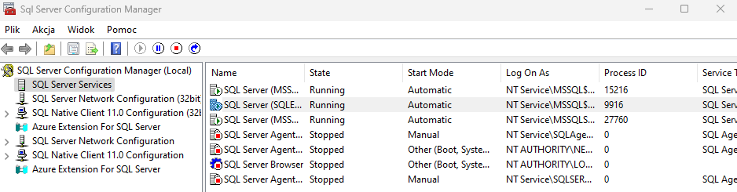

# SwimTrainingApp
Aplikacja do śledzenia treningów pływackich.

Instrukcje dotyczące instalacji oraz konfiguracji:

## Instrukcje instalacji

### 1. Klonowanie repozytorium

Skopiuj repozytorium na swoje urządzenie:

```bash
git clone https://github.com/mzkwcim/SwimTrainingApp.git
```
### 2. Instalacja Pakietów NuGet

Po sklonowaniu repozytorium należy zainstalować poniższe wymagane pakiety NuGet. 

### 3. Tworzenie bazy danych
1. Otwórz SQL Server Management Studio (SSMS)

- Jeżeli nie posiadasz (SSMS) zaistaluj go ze strony Microsoft:
https://learn.microsoft.com/en-us/sql/ssms/download-sql-server-management-studio-ssms?view=sql-server-ver16

    

2. Połącz się z serverem i wpisz w nazwie servera localhost\SQLEXPRESS


Następnie utwórz nową bazę w zakładce databases o nazwie SwimTrainingDB
(prawym przyciskiem myszy na databases)

3. Następnie należy pobrać SQL Server Express ze strony:
https://www.microsoft.com/pl-pl/sql-server/sql-server-downloads

4. Otwórz SQL Server Configuration Manager.

- Wejdź w SQL Server Services i Upewnij się, że masz włączoną usługę SQL Server Express, jeżeli nie to aktywuj ją.


- Przejdź do sekcji Protocols for SQLEXPRESS i kliknij prawym przyciskiem myszy na TCP/IP.

- Wybierz Enable i przejdź do zakładki Properties.

- W sekcji IP Addresses ustaw AllPorts na wartość 1433.

- Zrestartuj usługę serwera SQL.


### 4. Migracje baz danych

W terminalu, przejdź do folderu projektu i uruchom poniższe komendy, aby zaktualizować bazę danych na podstawie modeli:

    dotnet ef migrations add InitialCreate
    dotnet ef database update   
I dzięki temu w ssms powinno Ci się wszystko stworzyć na bazie modeli

### Instrukcja obsługi

1. Tabela treningów
Tabela treningów pozwala na zarządzanie informacjami dotyczącymi treningów. Dostępne funkcje:

    • Stwórz trening
Umożliwia dodanie nowego treningu do systemu.

    • Sprawdź trening
Wyświetla szczegóły istniejących treningów.

    • Edytuj trening
Umożliwia wprowadzenie zmian w istniejących treningach,

    • Usuń trening
Usuwa wybrany trening z systemu.

2. Tabela frekwencji
Tabela frekwencji pozwala monitorować obecność uczestników na treningach. Dostępne funkcje:

    • Stwórz frekwencję
Dodaje nowy wpis dotyczący frekwencji dla konkretnego treningu.
    
    • Sprawdź frekwencję
Wyświetla dane o obecności uczestników na treningach.

    •Edytuj frekwencję
Umożliwia wprowadzenie zmian w istniejących wpisach dotyczących frekwencji.

    • Usuń frekwencję
Usuwa wybrane wpisy dotyczące frekwencji.

3. Statystyki
Sekcja statystyk umożliwia analizę danych dotyczących treningów i uczestników. Dostępne statystyki:

    • Rozkład typów zadań
Przedstawia podział zadań.

    • Statystyki zadań dla uczestników
Wyświetla dane o zadaniach wykonanych przez poszczególnych uczestników.

    • Całkowite statystyki zadań
Podsumowanie wszystkich zadań wykonanych w systemie, przedstawiające ogólny obraz aktywności.

4. Zmiana ról użytkowników
Program umożliwia zmianę ról użytkowników.
